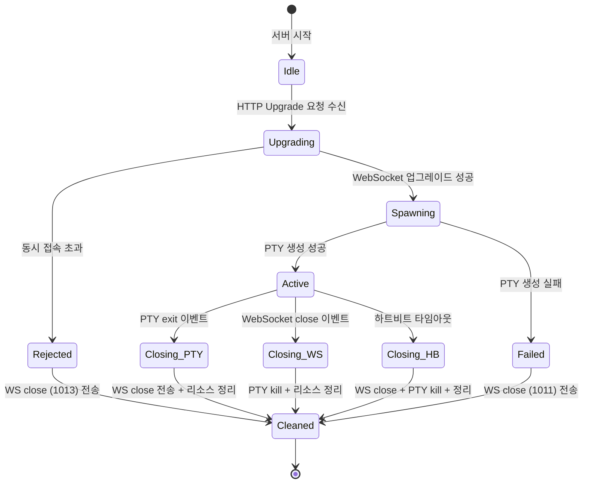

# 사용자 흐름

> terminal-api의 "사용자"는 클라이언트(웹 터미널)이다. 이 문서는 서버 사이드의 연결 생명주기, 프로세스 관리, 에러 처리 흐름을 정의한다.

## 1. 기본 흐름: WebSocket 연결 → PTY 생성 → 데이터 중계

1. 클라이언트가 `/api/terminal`로 HTTP 요청 (Upgrade: websocket)
2. API Route 핸들러 진입
3. WebSocket 서버 인스턴스 확인 (없으면 싱글턴 생성)
4. 활성 연결 수 확인
   - 10개 초과 → WebSocket close (1013) + 종료
5. HTTP → WebSocket 업그레이드 수행
6. `node-pty.spawn()` 호출 → PTY 프로세스 생성
   - 쉘: `process.env.SHELL || '/bin/zsh'`
   - cwd: `process.env.HOME`
   - env: `{ ...process.env, TERM: 'xterm-256color' }`
   - 초기 크기: 80×24 (클라이언트 리사이즈 메시지 대기)
7. PTY 이벤트 바인딩
   - `onData` → WebSocket 전송 (0x01 + data)
   - `onExit` → WebSocket close (1000, "PTY exited")
8. WebSocket 이벤트 바인딩
   - `message` → 메시지 타입별 분기 처리
   - `close` → PTY kill + 리소스 정리
   - `error` → 로그 + PTY kill + 정리
9. 하트비트 타이머 시작 (30초 간격 체크)
10. 양방향 데이터 중계 시작

## 2. 메시지 수신 처리 흐름

```
WebSocket message 수신
→ 첫 바이트로 타입 판별
→ 타입별 분기:

  0x00 (STDIN):
    payload → pty.write(payload)

  0x02 (RESIZE):
    cols = payload[0:2] as uint16 BE
    rows = payload[2:4] as uint16 BE
    → pty.resize(cols, rows)

  0x03 (HEARTBEAT):
    → 하트비트 타이머 리셋
    → WebSocket send (0x03) // pong

  그 외:
    → 무시 (로그 기록)
```

## 3. PTY stdout 전송 흐름

```
PTY onData 이벤트
→ data (Buffer)
→ frame = [0x01] + data
→ WebSocket send(frame)
→ (실패 시) backpressure 체크:
  - ws.bufferedAmount > 1MB → pty.pause()
  - ws.bufferedAmount < 256KB → pty.resume()
```

### backpressure 상세

- `ws.bufferedAmount`: WebSocket 전송 큐에 쌓인 미전송 데이터 크기
- 임계치 상한 (1MB): PTY 읽기 일시 중단 → 클라이언트가 소화할 시간 확보
- 임계치 하한 (256KB): PTY 읽기 재개
- 체크 주기: PTY onData 이벤트마다

## 4. 연결 종료 흐름

### 정상 종료 (PTY exit)

```
사용자 exit / Ctrl+D
→ PTY 프로세스 종료
→ pty.onExit({ exitCode, signal })
→ WebSocket send close (1000, "PTY exited")
→ 하트비트 타이머 정리
→ 활성 연결 카운트 감소
→ 로그: "[terminal] pty exited (pid: N, code: 0)"
```

### 비정상 종료 (WebSocket 끊김)

```
WebSocket close/error 이벤트
→ PTY 프로세스가 아직 살아있는지 확인
→ pty.kill() 호출
→ 하트비트 타이머 정리
→ 활성 연결 카운트 감소
→ 로그: "[terminal] client disconnected (active: N)"
```

### 하트비트 타임아웃

```
마지막 하트비트 수신으로부터 90초 경과
→ WebSocket close (1001, "Heartbeat timeout")
→ PTY kill
→ 리소스 정리
```

## 5. 서버 종료 흐름

```
process.on('SIGTERM') / process.on('SIGINT')
→ 모든 활성 WebSocket에 close 전송 (1001, "Server shutting down")
→ 모든 활성 PTY kill
→ WebSocket 서버 close
→ 프로세스 종료
```

## 6. 상태 전이



## 7. 엣지 케이스

### PTY 생성 실패

- `node-pty`가 설치되지 않았거나 네이티브 빌드 실패
- 지정된 쉘 경로가 존재하지 않음
- 처리: WebSocket close (1011, "PTY spawn failed") + 에러 로그

### 좀비 프로세스 방지

- PTY 종료 시 `pty.kill()` 명시적 호출
- WebSocket 이벤트 리스너 정리 (메모리 누수 방지)
- `process.on('exit')` 핸들러에서도 활성 PTY 정리

### WebSocket 서버 HMR 중복 생성

- 개발 환경에서 코드 변경 시 API Route가 재로드됨
- `(globalThis as any).__wsServer` 패턴으로 싱글턴 보장
- 기존 WebSocket 서버가 있으면 재사용, 없으면 새로 생성

### 동시에 WebSocket close + PTY exit

- 두 이벤트가 거의 동시에 발생할 수 있음
- 정리 로직은 멱등(idempotent)하게 구현 — 이미 정리된 상태면 무시
- `cleaned` 플래그로 중복 정리 방지
