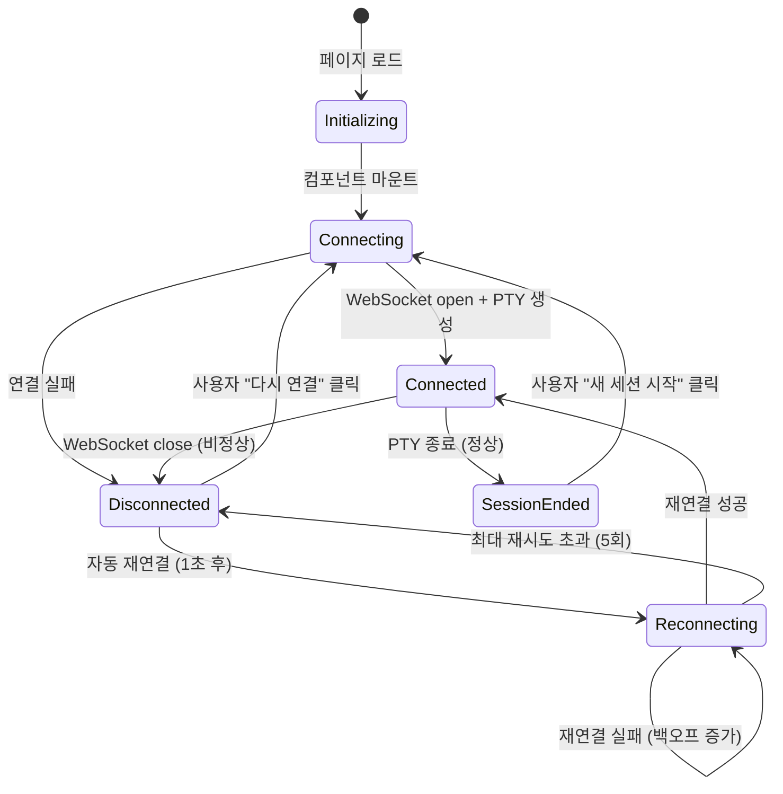

# 사용자 흐름

## 1. 기본 흐름: 페이지 접속 → 터미널 사용

1. 사용자가 `localhost:{port}`에 접속
2. Next.js가 페이지를 렌더링 (터미널 배경색만 보이는 빈 화면)
3. 폰트 로딩 시작 (JetBrains Mono)
4. 컴포넌트 마운트 → WebSocket 연결 시작 (`connecting` 상태)
   - 화면 중앙에 "연결 중..." 스피너 표시
5. WebSocket 연결 성공 → 서버에서 PTY 생성
6. xterm.js Terminal 인스턴스 생성 + 애드온 로드
7. `fitAddon.fit()` 호출 → 초기 cols/rows 계산
8. 초기 cols/rows를 리사이즈 메시지로 서버에 전달
9. PTY stdout 수신 시작 → 쉘 프롬프트가 화면에 렌더링
10. 사용자 입력 대기 (`connected` 상태, 상태 인디케이터 숨김)

**체감 속도 목표**: 접속 ~ 프롬프트 표시까지 500ms 이내 (로컬 환경)

## 2. 입력 처리 흐름

### 일반 키 입력

```
키 입력 → xterm.js onData → WebSocket send (0x00 + data) → PTY stdin
PTY stdout → WebSocket message (0x01 + data) → xterm.js write
```

- 에코는 PTY가 처리 (xterm.js는 로컬 에코 없음)
- 왕복 지연: <1ms (로컬 WebSocket)

### 한글 IME 입력

```
키 입력 → compositionstart → (조합 중, 전송 안 함)
       → compositionupdate → (화면에 조합 문자 표시)
       → compositionend → 확정된 문자를 WebSocket으로 전송
```

- xterm.js의 IME 처리 모듈이 composition 이벤트를 자동 관리
- 조합 중 문자는 xterm.js 커서 위치에 인라인 표시

### 클립보드 붙여넣기

```
Cmd+V / Ctrl+V → 브라우저 paste 이벤트
→ xterm.js onData (붙여넣은 텍스트)
→ WebSocket send (0x00 + text)
```

- 대량 텍스트 붙여넣기 시 xterm.js가 자동 분할 전송 (bracket paste mode 지원)

## 3. 리사이즈 흐름

```
브라우저 창 리사이즈
→ ResizeObserver 트리거
→ 디바운스 (100ms)
→ fitAddon.fit() → 새 cols/rows 계산
→ WebSocket send (0x02 + cols + rows)
→ 서버: PTY resize(cols, rows)
```

- vim, htop 등 TUI는 PTY 리사이즈 시 `SIGWINCH` 시그널을 받아 화면 재렌더링

## 4. 연결 끊김 → 재연결 흐름

```
WebSocket 연결 끊김 감지 (onclose / onerror)
→ 상태: disconnected
→ 자동 재연결 시작 (1초 후)
→ 상태: reconnecting (시도 1/5)
→ [성공] 새 WebSocket 연결 + 새 PTY 생성 → connected
→ [실패] 대기 시간 2배 증가 (지수 백오프)
→ ... 최대 5회 시도
→ [전부 실패] 상태: disconnected + "다시 연결" 버튼 표시
→ 사용자가 버튼 클릭 → 재연결 카운트 리셋, 처음부터 재시도
```

**주의**: 재연결 시 기존 PTY는 이미 종료됨. 새 PTY가 생성되므로 이전 세션의 상태(작업 디렉토리, 환경 변수 등)는 복원되지 않음. Phase 2(tmux) 이후에 세션 영속성 제공.

## 5. PTY 종료 흐름

```
사용자가 exit 입력 (또는 Ctrl+D)
→ PTY 프로세스 종료
→ 서버: PTY exit 이벤트 감지
→ WebSocket close 전송 (코드 1000, 이유 "PTY exited")
→ 클라이언트: onclose 수신
→ 터미널 하단에 "세션이 종료되었습니다" + "새 세션 시작" 버튼 표시
→ 자동 재연결 하지 않음 (정상 종료이므로)
→ 사용자가 "새 세션 시작" 클릭 → 새 WebSocket 연결 + 새 PTY
```

## 6. 대량 출력 흐름

```
PTY stdout 대량 데이터 발생 (예: find /)
→ 서버: PTY data → WebSocket send (즉시, 버퍼링 없음)
→ 클라이언트: WebSocket onmessage
→ 내부 큐에 적재
→ requestAnimationFrame 루프:
  - 큐에서 청크를 꺼내 xterm.js.write() 호출
  - 1프레임당 최대 처리량 제한 (16ms 안에 가능한 만큼)
  - 큐가 비어있으면 루프 중단
```

- 브라우저 프레임 레이트(60fps) 유지가 목표
- 큐 크기가 임계치 초과 시 사용자에게 눈에 띄는 지연 없음 (버퍼가 알아서 소화)

## 7. 상태 전이



## 8. 엣지 케이스

### 다중 탭 접속

- 같은 브라우저에서 여러 탭으로 접속 → 각 탭이 독립된 PTY를 생성
- 최대 동시 PTY 수(10) 초과 시: WebSocket 연결 후 즉시 close (코드 1013, "Max connections exceeded")
- 클라이언트에 "동시 접속 수 초과" 에러 메시지 표시

### 네트워크 순간 끊김

- WiFi 전환 등 1~2초 끊김 → 자동 재연결로 복구
- 하지만 기존 PTY는 서버에서 이미 정리됨 → 새 PTY 시작

### 서버 재시작 (pnpm dev HMR)

- 개발 중 코드 변경 → 서버 재시작 → WebSocket 끊김
- 자동 재연결 시 서버가 아직 준비 안 됐을 수 있음 → 백오프로 자연스럽게 해결

### 브라우저 탭 비활성화

- 탭이 백그라운드로 가면 `requestAnimationFrame` 중단
- 대량 출력이 큐에 쌓임 → 탭 복귀 시 한꺼번에 렌더링
- WebSocket 자체는 백그라운드에서도 유지

### 매우 긴 줄 출력

- xterm.js가 자동 줄바꿈 처리
- 리사이즈 시 줄바꿈 위치 재계산 (reflow)
