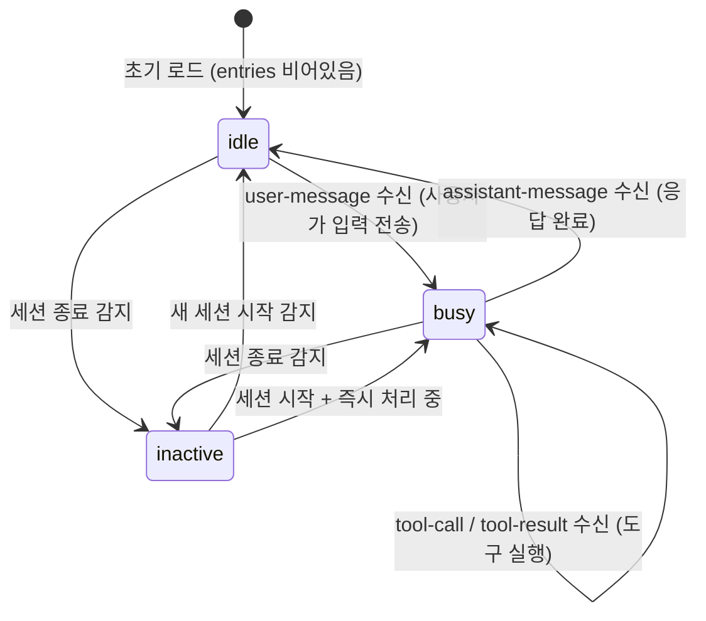

# 사용자 흐름

## 1. 상태 계산 흐름

```
1. 타임라인 데이터 변경 감지 (timeline:init 또는 timeline:append)
2. 마지막 엔트리 타입 확인:
   a. entries가 비어있음 → idle (새 세션, 첫 입력 대기)
   b. 마지막 엔트리 타입:
      - assistant-message → idle
      - user-message → busy
      - tool-call → busy
      - tool-result → busy
      - agent-group → busy
3. 세션 status 확인:
   a. sessionStatus === 'inactive' 또는 'none' → inactive (세션 status가 우선)
   b. sessionStatus === 'active' → 위 엔트리 기반 판단 적용
4. cliState 갱신 → 입력창 모드 즉시 전환
```

## 2. 상태 전이



## 3. 초기 로드 시 상태 결정 흐름

```
1. Claude Code Panel 마운트
2. GET /api/timeline/session → sessionStatus 확인
3. sessionStatus 기반 분기:
   a. active:
      i. timeline:init 수신
      ii. 마지막 엔트리 타입으로 idle/busy 결정
   b. inactive:
      i. cliState = inactive
      ii. timeline:init 수신 (읽기 전용 타임라인)
   c. none:
      i. cliState = inactive
4. 이후 timeline:append로 실시간 갱신
```

## 4. 세션 전환 시 상태 리셋 흐름

```
1. timeline:session-changed 수신 (새 세션 시작)
2. 기존 entries 초기화
3. cliState → idle (새 세션의 첫 입력 대기)
4. 새 세션에 대해 timeline:subscribe
5. timeline:init 수신 → 마지막 엔트리로 상태 재계산
```

## 5. 엣지 케이스

### assistant-message 직후 빠른 user-message

```
timeline:append로 assistant-message 수신 → cliState = idle
즉시 사용자가 Enter → user-message가 JSONL에 기록
timeline:append로 user-message 수신 → cliState = busy
├── idle → busy 전환이 매우 짧은 시간 내 발생
└── React batch update로 자연스럽게 처리
```

### 서브에이전트 그룹 실행 중

```
agent-group 엔트리 수신
├── cliState = busy (서브에이전트 작업 중)
├── 서브에이전트 완료 후 assistant-message 수신
└── cliState = idle
```

### WebSocket 재연결 후 상태 복원

```
WebSocket 끊김 → 재연결
├── timeline:init으로 전체 재로드
├── 마지막 엔트리로 cliState 재계산
└── 끊김 기간 동안의 상태 변화 자동 반영
```

### 세션 파일 기록 지연

```
Claude Code가 응답 생성 중이지만 JSONL에 아직 기록 안 됨
├── 마지막 엔트리가 user-message → cliState = busy (정상)
├── JSONL 기록 완료 → timeline:append → assistant-message → idle
└── 기록 전까지 busy 유지 = 실제 상태와 일치
```
