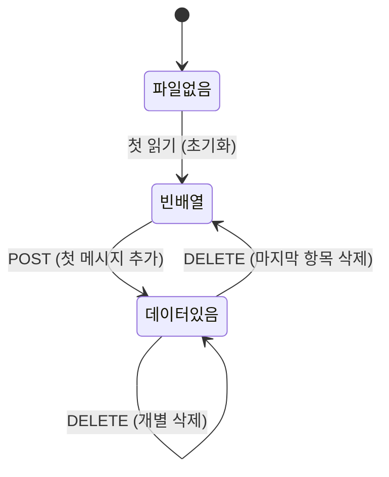

# 사용자 흐름

## 1. 메시지 추가 흐름 (POST)

```
1. 클라이언트: POST /api/message-history { wsId, message }
2. 유효성 검사:
   a. wsId 없음 → 400 반환
   b. message 없음 또는 공백만 → 400 반환
   c. 슬래시 커맨드 ('/'로 시작) → 400 반환
3. withLock(wsId) 진입
4. 기존 entries 읽기 (파일 없으면 빈 배열)
5. 중복 검사: 동일 message 텍스트 존재?
   a. 존재 → 기존 항목 제거
   b. 미존재 → 그대로 진행
6. 새 entry 생성: { id: nanoid(), message, sentAt: new Date().toISOString() }
7. 배열 앞(unshift)에 삽입
8. 500개 초과 시 배열 끝(pop)에서 제거
9. atomic write: .tmp → rename
10. lock 해제
11. 201 응답: { entry }
```

## 2. 목록 조회 흐름 (GET)

```
1. 클라이언트: GET /api/message-history?wsId=...
2. 유효성 검사:
   a. wsId 없음 → 400 반환
3. 파일 읽기 시도
   a. 파일 없음 → { entries: [] } 반환
   b. 파싱 실패 → { entries: [] } 반환 (console.warn)
   c. 정상 → { entries } 반환 (MRU 순서 유지)
4. 200 응답: { entries }
```

## 3. 개별 삭제 흐름 (DELETE)

```
1. 클라이언트: DELETE /api/message-history { wsId, id }
2. 유효성 검사:
   a. wsId 없음 → 400 반환
   b. id 없음 → 400 반환
3. withLock(wsId) 진입
4. 기존 entries 읽기
5. id에 해당하는 항목 필터링 제거
   a. 존재하지 않는 id → 그대로 진행 (멱등성)
6. atomic write
7. lock 해제
8. 200 응답: { success: true }
```

## 4. 상태 전이



## 5. 중복 메시지 처리 흐름

```
기존 entries:
  [0] "테스트해줘"     (10:30)
  [1] "리팩토링해줘"    (10:25)
  [2] "커밋해줘"       (10:20)

POST { message: "커밋해줘" }

처리:
  1. "커밋해줘" 검색 → [2]에서 발견
  2. [2] 제거
  3. 새 entry { "커밋해줘", 10:35 } 를 [0]에 삽입

결과:
  [0] "커밋해줘"       (10:35)  ← MRU
  [1] "테스트해줘"     (10:30)
  [2] "리팩토링해줘"    (10:25)
```

## 6. 500개 제한 처리 흐름

```
기존 entries: 500개 (꽉 참)

POST { message: "새 메시지" } (중복 아님)

처리:
  1. 중복 없음
  2. [0]에 "새 메시지" 삽입 → 501개
  3. 배열 끝 [500] 제거 → 500개

결과: 가장 오래된 항목 1개 제거, 새 메시지가 최상단
```

## 7. 엣지 케이스

### 동시 쓰기

```
요청 A (POST "메시지1") ─────┐
요청 B (POST "메시지2") ──┐  │
                          │  │
withLock(wsId):           │  │
  요청 A 실행 ────────────┘  │
  요청 A 완료                │
  요청 B 실행 ───────────────┘
  요청 B 완료

→ 두 메시지 모두 안전하게 저장
```

### 파일 손상

```
message-history.json 파싱 실패
├── readMessageHistory → 빈 배열 반환, console.warn
├── addMessageHistory → 빈 배열 기반으로 새 파일 생성
└── 사용자에게 에러 표시 안 함
```

### 워크스페이스 삭제

```
워크스페이스 삭제 API 호출
├── fs.rm(resolveLayoutDir(wsId), { recursive: true })
├── layout.json 삭제
├── message-history.json 삭제  ← 자동 정리
└── 추가 코드 불필요
```
