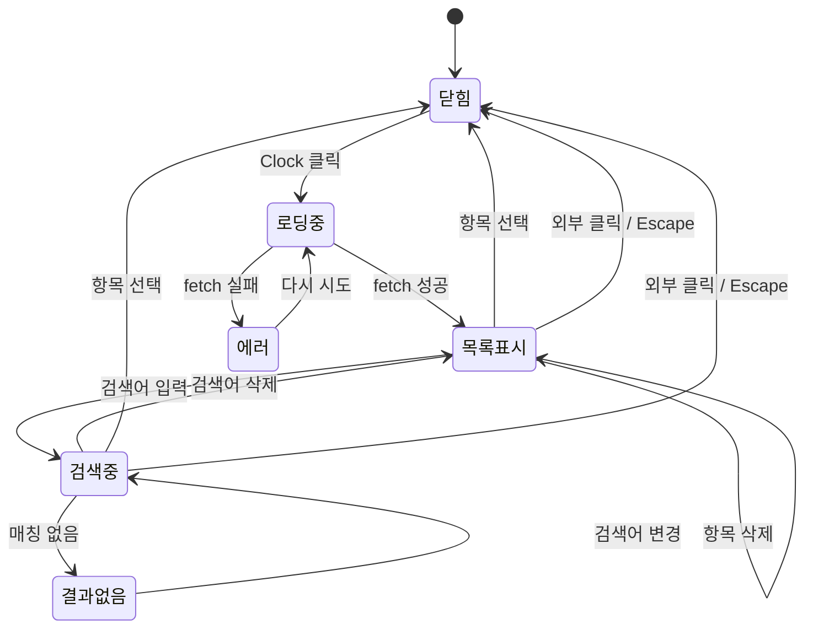

# 사용자 흐름

## 1. 히스토리에서 메시지 선택 흐름

```
1. 입력창 왼쪽 Clock 아이콘 확인
   a. 히스토리 비어있음 → 아이콘 비활성 (흐름 종료)
   b. 히스토리 있음 → 아이콘 활성
2. Clock 아이콘 클릭
3. 디바이스 분기:
   a. 데스크톱 → Popover 열림
   b. 모바일 → Drawer 열림
4. fetch: GET /api/message-history?wsId=... (매번 최신 데이터)
5. 로딩 중 → 스피너 표시
6. 데이터 도착 → 항목 목록 표시 (MRU 순서)
7. 사용자: 항목 클릭 (예: "이 함수를 리팩토링해줘")
8. 입력창(textarea)에 메시지 텍스트 채움 (기존 내용 덮어쓰기)
9. Popover/Drawer 닫힘
10. textarea에 포커스 이동
11. 사용자: 내용 확인/수정 후 Enter로 전송
```

## 2. 히스토리 검색 흐름

```
1. Popover/Drawer 열림 → 검색 입력에 자동 포커스
2. 사용자: 검색어 입력 (예: "리팩")
3. 실시간 필터링: "리팩토링해줘" 등 매칭 항목만 표시
4. 매칭 결과 없음 → "검색 결과가 없습니다" 표시
5. 사용자: 필터된 항목 중 선택 → 흐름 1의 7번부터 동일
```

## 3. 히스토리 항목 삭제 흐름

```
1. Popover/Drawer에서 항목에 마우스 hover (데스크톱) 또는 항목 표시 (모바일)
2. 항목 오른쪽 X 버튼 표시
3. X 버튼 클릭 (e.stopPropagation으로 항목 선택 이벤트 차단)
4. 낙관적 업데이트: 로컬 상태에서 즉시 제거
5. 백그라운드: DELETE /api/message-history { wsId, id }
6. 삭제 성공 → 완료
7. 삭제 실패 → 로컬 상태 롤백 (항목 복원)
8. 마지막 항목 삭제 시 → "히스토리가 없습니다" 표시
```

## 4. 메시지 전송 시 히스토리 저장 흐름

```
1. 사용자: 입력창에 메시지 작성 후 Enter
2. use-web-input의 send() 실행
3. 기존 전송 로직 수행 (PTY write)
4. 전송 성공 후 조건 확인:
   a. 빈 문자열 / 공백만 → 저장 안 함 (기존 early return)
   b. RESTART_COMMANDS (/new, /clear) → 저장 안 함
   c. 슬래시 커맨드 ('/'로 시작) → 저장 안 함
   d. 일반 메시지 → 저장 진행
5. addHistory(message) 호출 (fire-and-forget)
6. 낙관적 업데이트: 로컬 entries 상태에 즉시 추가
7. 백그라운드: POST /api/message-history { wsId, message }
8. 저장 실패 → 무시 (메시지 전송은 이미 성공, 히스토리 저장은 부가 기능)
```

## 5. Popover/Drawer 열기/닫기 흐름

```
열기:
  Clock 클릭 → open=true → fetch 시작 → 데이터 표시

닫기 (아래 중 하나):
  a. 항목 선택 → 입력창 채움 + 닫기
  b. Popover 외부 클릭 → 닫기
  c. Escape 키 → 닫기
  d. Drawer 아래로 스와이프 → 닫기

닫기 후:
  → textarea 포커스 복귀
```

## 6. 상태 전이



## 7. 엣지 케이스

### 입력창에 텍스트가 있는 상태에서 히스토리 항목 선택

```
입력창: "현재 입력 중인 텍스트"
히스토리 항목 "리팩토링해줘" 클릭
├── 입력창 텍스트가 "리팩토링해줘"로 덮어쓰기
├── 기존 draft도 갱신
└── 사용자가 Enter로 전송 또는 수정
```

### 멀티라인 메시지 선택

```
히스토리 항목: "테스트 코드 작성해줘\n유닛 테스트 위주로\n커버리지 80% 이상"
항목 표시: "테스트 코드 작성해줘" (첫 줄만 truncate)
클릭 시: 전체 멀티라인 텍스트가 입력창에 채워짐 (모든 줄 포함)
textarea 높이: 자동 확장
```

### disabled 모드에서의 동작

```
cliState === 'inactive' (Claude Code 미실행)
├── Clock 아이콘 비활성 (opacity-50, pointer-events-none)
├── Popover/Drawer 열 수 없음
└── 히스토리 데이터에는 영향 없음 (서버 데이터 유지)
```

### Quick Prompt → 히스토리 저장

```
Quick Prompt "커밋하기" 클릭
├── 입력창에 "/commit-commands:commit" 채움
├── 사용자 Enter → send() 실행
├── 슬래시 커맨드 판별: '/'로 시작 → 히스토리 저장 안 함
└── PTY 전송만 수행
```

### 동일 메시지 반복 전송

```
"테스트해줘" 전송 (히스토리에 추가)
"리팩토링해줘" 전송 (히스토리에 추가)
"테스트해줘" 다시 전송
├── 낙관적 업데이트: 기존 "테스트해줘" 제거 → 최상단 재삽입
├── POST 호출 → 서버에서 MRU 갱신
└── 다음 Popover 열 때 최신 순서 반영
```

### fetch 중 Popover 닫기

```
Clock 클릭 → fetch 시작 → 사용자 즉시 외부 클릭
├── Popover 닫힘
├── fetch 응답 도착 → 무시 (Popover 이미 닫힘)
└── 다음 열 때 다시 fetch
```
