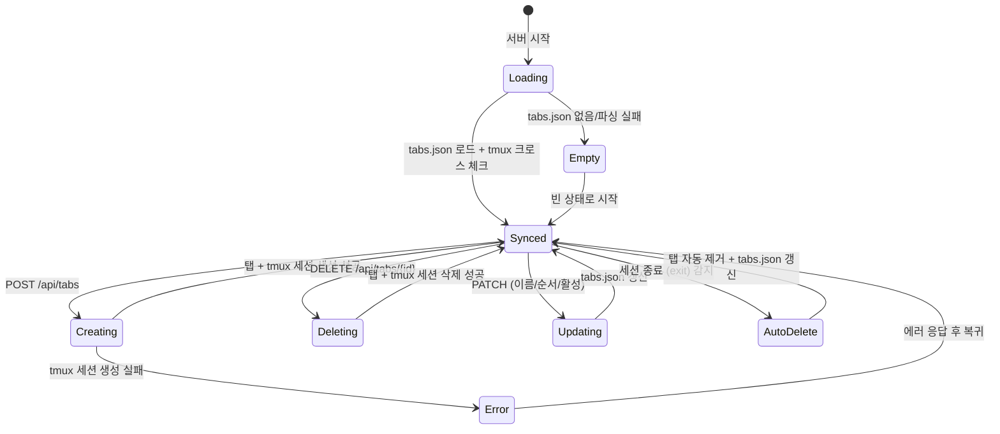

# 사용자 흐름

> tab-api의 "사용자"는 클라이언트(탭 UI)이다. 이 문서는 서버 사이드의 탭 CRUD, 영속성, 정합성 흐름을 정의한다.

## 1. 서버 시작 시 정합성 체크

```
서버 시작
→ tabs.json 읽기 (없거나 파싱 실패 시 빈 상태)
→ tmux -L purple ls → pt-* 세션 목록 조회
→ 크로스 체크:

  tabs.json에 있지만 tmux에 없는 탭:
  → tabs.json에서 제거 (stale tab)
  → 로그: "[tabs] sync: removed stale tab-abc123"

  tmux에 있지만 tabs.json에 없는 세션:
  → 새 탭으로 추가 (orphan recovery)
  → 기본 이름: "Recovered {N}"
  → 로그: "[tabs] sync: recovered orphan pt-x1y2z3-..."

→ tabs.json 갱신 저장
→ 로그: "[tabs] sync: removed {N} stale, recovered {M} orphan"
```

## 2. 탭 생성 흐름

```
POST /api/tabs
→ body에서 name 추출 (없으면 "Terminal {N}" 생성)
→ nanoid로 tab ID 생성 (tab-{nanoid})
→ nanoid로 세션 이름 생성 (pt-{w}-{p}-{s})
→ tmux -L purple new-session -d -s {sessionName} -x 80 -y 24 -f {configPath}
  - 실패 시 500 + 에러 메시지
→ 탭 목록에 추가 (order = 현재 최대 + 1)
→ tabs.json 저장 (디바운스)
→ 201 + 탭 정보 반환
```

## 3. 탭 삭제 흐름

```
DELETE /api/tabs/{tabId}
→ tabId로 탭 찾기 (없으면 404)
→ 해당 탭의 sessionName 확인
→ tmux -L purple kill-session -t {sessionName}
  - 실패 무시 (이미 종료된 세션일 수 있음)
→ tabs.json에서 탭 제거
→ tabs.json 저장
→ 204 No Content
```

- 해당 세션에 활성 WebSocket이 있으면 → tmux kill로 인해 attach PTY onExit 발생 → close code 1000 자동 전송

## 4. 탭 이름 변경 흐름

```
PATCH /api/tabs/{tabId}
→ body에서 name 추출
→ 빈 문자열/whitespace만 → 400 에러
→ 탭 찾기 (없으면 404)
→ 이름 업데이트
→ tabs.json 저장
→ 200 + 업데이트된 탭 정보
```

## 5. 탭 순서 변경 흐름

```
PATCH /api/tabs/order
→ body에서 tabIds 배열 추출
→ 기존 탭 목록과 비교 (누락/추가된 ID 있으면 400)
→ tabIds 순서대로 order 재할당 (0, 1, 2, ...)
→ tabs.json 저장
→ 200 + 업데이트된 탭 목록
```

## 6. 활성 탭 저장 흐름

```
PATCH /api/tabs/active
→ body에서 activeTabId 추출
→ 해당 탭 존재 여부 확인 (없으면 무시, 200 반환)
→ activeTabId 업데이트
→ tabs.json 저장
→ 200 OK
```

## 7. 세션 종료 시 자동 탭 삭제 (exit)

```
terminal-server에서 세션 종료 감지 (detaching=false → onExit)
→ removeTabBySession(sessionName) 호출
→ 탭 목록에서 해당 세션의 탭 제거
→ tabs.json 저장
```

- 클라이언트 측: close code 1000 수신 → 탭 바에서 해당 탭 제거 → 인접 탭 전환
- 서버와 클라이언트 양쪽에서 동시에 탭 제거 (서버: 다음 GET 조회 시 반영, 클라이언트: 즉시 UI 반영)

## 8. tabs.json 저장 전략

```
탭 변경 이벤트 발생
→ 디바운스 큐에 저장 요청 추가
→ 300ms 대기 (추가 변경 없으면)
→ JSON.stringify → fs.writeFile
→ 에러 시 로그 출력 (다음 시도에서 재시도)
```

- 서버 종료 시 (graceful shutdown) → 디바운스 flush → 즉시 저장
- 디렉토리 없으면 `fs.mkdir(recursive: true)`로 자동 생성

## 9. 상태 전이



## 10. 엣지 케이스

### tabs.json 파일 손상

- JSON 파싱 실패 시 빈 상태로 시작
- tmux 세션은 살아있으므로 orphan 복구로 모든 세션이 탭으로 복원
- 데이터 손실 최소화

### 디스크 쓰기 실패

- tabs.json 저장 실패 시 에러 로그 출력
- 인메모리 상태는 유지 → 다음 저장 시도에서 복구
- 서버가 크래시하면 마지막 성공 저장 시점으로 복원 (tmux orphan 복구로 보완)

### 동시 API 요청

- tabs.json 쓰기는 디바운스로 직렬화됨
- 인메모리 상태가 진실 소스 (truth), tabs.json은 영속성 레이어
- 동시 요청이 인메모리 상태를 경쟁적으로 수정할 가능성 → 단일 프로세스이므로 이벤트 루프에서 직렬 처리

### 서버 크래시 (비정상 종료)

- tabs.json이 마지막 디바운스 flush 시점의 상태
- tmux 세션은 살아있음
- 재시작 시 크로스 체크로 정합성 복구
