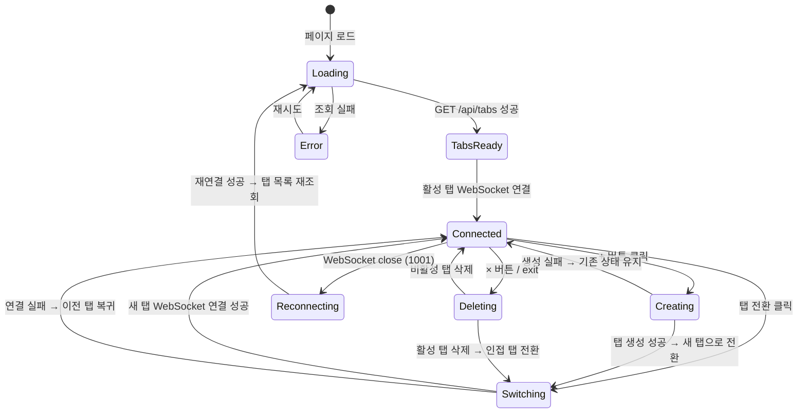

# 사용자 흐름

## 1. 페이지 로드 → 탭 복원

1. 사용자가 `localhost:{port}`에 접속
2. 페이지 렌더링 (탭 스켈레톤 + 터미널 배경)
3. `GET /api/tabs` → 탭 목록 조회
4. 탭 목록이 비어있으면 → `POST /api/tabs` → 첫 탭 자동 생성
5. 탭 바에 탭 목록 렌더링
6. 마지막 활성 탭의 세션에 WebSocket 연결 (`/api/terminal?session={id}`)
7. tmux attach → 화면 redraw → 터미널 렌더링
8. `PATCH /api/tabs/active` → 활성 탭 저장

**체감 속도 목표**: 페이지 로드 ~ 터미널 프롬프트까지 700ms 이내 (탭 조회 + WebSocket)

## 2. 탭 생성

```
+ 버튼 클릭
→ + 버튼 disabled (로딩 피드백)
→ POST /api/tabs → 서버: tmux 세션 생성 → 탭 정보 반환
→ 탭 바에 새 탭 추가 (맨 우측, 즉시 활성)
→ 현재 WebSocket 닫기 (detach)
→ xterm.js reset()
→ 새 세션 ID로 WebSocket 연결
→ 쉘 프롬프트 표시
→ + 버튼 다시 활성화
→ PATCH /api/tabs/active
```

### 실패 시

- POST 실패 → + 버튼 다시 활성화 + toast 에러 ("탭을 생성할 수 없습니다")
- 기존 탭/터미널은 영향 없음

## 3. 탭 전환

```
비활성 탭 클릭
→ UI: 클릭한 탭을 즉시 활성으로 표시 (optimistic)
→ 현재 WebSocket 닫기 (서버: detaching=true → tmux detach)
→ xterm.js reset()
→ 터미널 영역: connecting 인디케이터
→ 새 WebSocket 연결 (/api/terminal?session={id})
→ tmux attach → 자동 redraw → 이전 화면 복원
→ connecting 인디케이터 fade out
→ PATCH /api/tabs/active
```

### Optimistic UI 롤백

- WebSocket 연결 실패 시 → 이전 활성 탭으로 복귀 + 에러 표시
- tmux 세션이 사라진 경우 (exit로 종료됨) → 해당 탭 제거 + 인접 탭 전환

## 4. 탭 삭제 (× 버튼)

```
× 버튼 클릭
→ 활성 탭인 경우:
  → 인접 탭으로 즉시 전환 (optimistic)
  → 새 탭에 WebSocket 연결
→ DELETE /api/tabs/{id} → 서버: tmux kill-session + tabs.json 갱신
→ 탭 바에서 해당 탭 제거 (fade out 150ms)
→ 마지막 탭이었으면 → POST /api/tabs → 새 탭 자동 생성
```

### 비활성 탭 삭제

- 현재 터미널에 영향 없음
- 서버에 DELETE 요청 → 탭 바에서 제거

## 5. 탭 내 exit

```
사용자가 터미널에서 exit 입력
→ tmux 세션 종료 → WebSocket close code 1000
→ 클라이언트: 해당 탭 자동 삭제
→ tabs.json 갱신 (서버 측 자동)
→ 인접 탭으로 전환 (우측 우선)
→ 마지막 탭이었으면 새 탭 자동 생성
```

- session-ended 오버레이는 표시하지 않음 → 즉시 인접 탭으로 전환하는 것이 자연스러움

## 6. 탭 순서 변경

```
탭 드래그 시작
→ 드래그 대상 반투명 표시
→ 드래그 중: 드롭 위치에 파란색 인디케이터
→ 드롭
→ UI: 즉시 순서 반영 (optimistic)
→ PATCH /api/tabs/order
```

### 실패 시

- 서버 업데이트 실패 → 이전 순서로 복귀

## 7. 탭 이름 변경

```
탭 더블클릭
→ 탭 이름이 인라인 input으로 전환 (기존 이름 선택 상태)
→ 사용자 입력
→ Enter 또는 blur
→ UI: 즉시 새 이름 반영
→ PATCH /api/tabs/{id} → tabs.json 저장
→ Escape: 편집 취소, 이전 이름 복원
```

## 8. 새로고침

```
F5/Cmd+R
→ 현재 WebSocket 끊김 (서버: detaching=true)
→ 페이지 리로드
→ GET /api/tabs → 탭 목록 + 마지막 활성 탭 복원
→ 활성 탭 세션에 WebSocket 연결
→ tmux redraw → 이전 화면 복원
```

## 9. 서버 재시작

```
서버 종료 → 모든 WebSocket close (1001)
→ 클라이언트: reconnecting 상태
→ 서버 재시작 → tmux 세션 모두 살아있음 + tabs.json 정합성 체크
→ 클라이언트 재연결 → GET /api/tabs → 탭 복원
→ 활성 탭 세션에 WebSocket 연결
→ 화면 복원
```

## 10. 상태 전이



## 11. 엣지 케이스

### 빠른 연속 탭 전환

- Tab A → Tab B → Tab C를 빠르게 클릭
- 이전 전환의 WebSocket 연결이 완료되기 전에 새 전환 시작
- 처리: 진행 중인 WebSocket 연결을 abort → 최신 전환만 처리

### 탭 생성 중 다른 탭 클릭

- + 버튼 클릭 → 생성 중 → 다른 탭 클릭
- 처리: 생성 완료 후 새 탭이 추가되지만 활성화하지 않음 (클릭한 탭이 활성)

### 다중 브라우저에서 같은 탭 삭제

- Browser A에서 탭 삭제 → Browser B에 아직 반영 안 됨
- Browser B에서 해당 탭 전환 시도 → WebSocket 1011 (세션 없음) → 탭 제거 + 인접 탭 전환

### exit + 마지막 탭

- 단일 탭에서 exit → 세션 종료 → 탭 삭제 → 새 탭 자동 생성 → WebSocket 연결
- 사용자 체감: "exit 후 새 터미널이 바로 시작됨"
