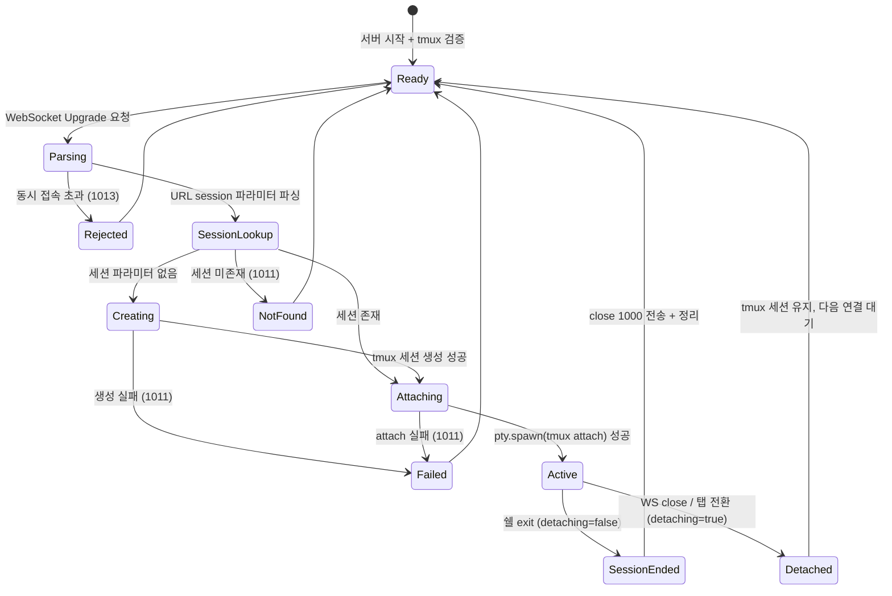

# 사용자 흐름

> terminal-session의 "사용자"는 클라이언트(탭 UI)이다. 이 문서는 서버 사이드의 다중 세션 관리 흐름을 정의한다.

## 1. WebSocket 연결 흐름 (세션 파라미터 있음)

```
클라이언트: WebSocket 연결 (/api/terminal?session=pt-a1b2c3-...)
→ server.ts upgrade 핸들러
→ URL 파싱: session = "pt-a1b2c3-..."
→ 활성 연결 수 확인 (10개 초과 → 1013)
→ WebSocket 업그레이드
→ tmux -L purple has-session -t pt-a1b2c3-...
  - 있음 → pty.spawn('tmux', ['-L', 'purple', 'attach', '-t', sessionName])
  - 없음 → WebSocket close (1011, "Session not found")
→ tmux 자동 redraw → 클라이언트에 화면 전달
→ 양방향 I/O 중계 시작
```

## 2. WebSocket 연결 흐름 (세션 파라미터 없음)

```
클라이언트: WebSocket 연결 (/api/terminal)
→ server.ts upgrade 핸들러
→ URL 파싱: session = null
→ 활성 연결 수 확인
→ WebSocket 업그레이드
→ 새 tmux 세션 생성 (nanoid 기반 이름)
→ pty.spawn('tmux', ['-L', 'purple', 'attach', '-t', newSessionName])
→ 쉘 프롬프트 렌더링
→ 양방향 I/O 중계 시작
```

Phase 2 하위 호환. 단, Phase 3에서는 주로 탭 API를 통해 세션을 생성하므로 이 경로는 fallback 용도.

## 3. 탭 전환 시 서버 흐름

```
탭 A → 탭 B 전환

[탭 A 연결 해제]
클라이언트: WebSocket close
→ 서버: ws.on('close') 이벤트
→ detaching = true (탭 전환은 의도적 detach)
→ pty.kill() → tmux detach
→ onExit: detaching=true → close code 미전송
→ connections에서 제거
→ tmux 세션 A는 살아있음

[탭 B 연결]
클라이언트: WebSocket 연결 (/api/terminal?session={B})
→ 위 흐름 1번과 동일
→ tmux 세션 B에 attach → 화면 redraw
```

## 4. 세션 종료 흐름 (exit)

```
사용자: 터미널에서 exit 입력
→ tmux 세션 내 쉘 종료
→ tmux 세션 소멸
→ attach PTY onExit 발생
→ detaching === false → 세션이 진짜 종료됨
→ WebSocket close (1000, "Session exited")
→ connections에서 제거
→ 서버: tabs.json에서 해당 탭 제거
```

## 5. 세션 종료 흐름 (탭 삭제 API)

```
클라이언트: DELETE /api/tabs/{id}
→ 서버: tmux -L purple kill-session -t {sessionName}
→ tmux 세션 강제 종료
→ 해당 세션에 활성 WebSocket이 있으면:
  → attach PTY onExit 발생
  → detaching === false → close code 1000 전송
→ tabs.json 갱신
```

## 6. 서버 종료 흐름

```
SIGTERM / SIGINT
→ 모든 활성 WebSocket에 close (1001, "Server shutting down")
→ 모든 attach PTY: detaching = true → pty.kill()
→ 모든 tmux 세션 유지
→ tabs.json 최종 저장 (디바운스 flush)
→ 프로세스 종료
```

## 7. 상태 전이



## 8. 엣지 케이스

### 세션 파라미터 조작

- 유효하지 않은 세션 이름 (pt- 접두사 없음, 특수문자 등)
- 처리: tmux has-session 실패 → 1011

### 동일 세션에 다중 WebSocket

- 다른 브라우저 탭에서 같은 세션에 연결 가능
- tmux aggressive-resize로 마지막 attach 크기 우선
- 양쪽 모두 동일 입출력 공유

### 탭 전환 중 서버 종료

- 이전 탭 detach 완료 → 새 탭 연결 전에 서버 종료
- 클라이언트: 연결 실패 → reconnecting → 서버 재시작 후 복원

### 탭 삭제 API와 WebSocket close 동시

- DELETE API로 세션 kill → 동시에 WebSocket close
- Phase 2의 `cleaned` 플래그 + `detaching` 플래그로 중복 처리 방지 (멱등성)
