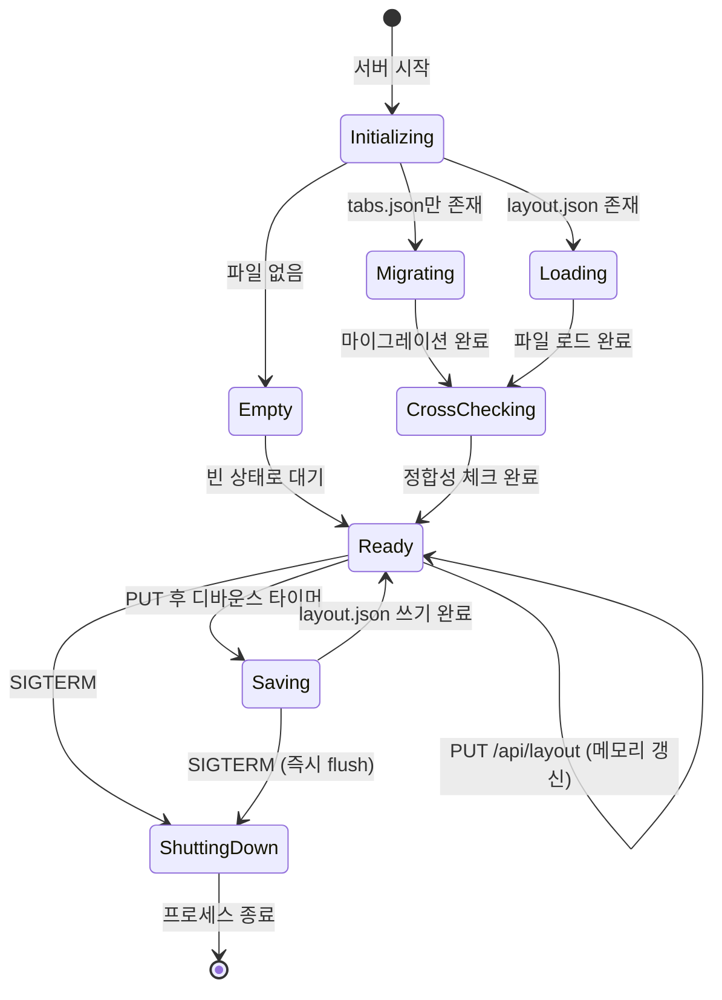

# 사용자 흐름

> layout-api는 서버 사이드이므로, "사용자 흐름"은 서버 라이프사이클과 API 요청 처리 흐름을 정의한다.

## 1. 서버 시작 → 레이아웃 초기화

```
서버 시작 (server.ts)
→ tmux 환경 검증 (Phase 2와 동일)
→ layout.json 로드 시도
→ layout.json 없음?
  → tabs.json 존재?
    → Yes: tabs.json → layout.json 마이그레이션
    → No: 빈 상태 (첫 GET 요청 시 기본 Pane 생성)
→ layout.json 로드 성공
→ tmux 세션 크로스 체크:
  1. layout.json의 모든 탭 순회
  2. 각 탭의 sessionName으로 `tmux -L purple has-session -t {name}` 확인
  3. 세션 없는 탭 → 제거
  4. `tmux -L purple ls`로 `pt-*` 세션 전체 조회
  5. layout.json에 없는 세션 → 첫 번째 Pane에 orphan 탭 추가
  6. 빈 Pane 정리 (탭 0개 Pane → 단일 Pane이면 기본 탭 생성, 복수면 Pane 제거)
  7. 트리 정규화 (자식 1개인 split 노드 → 자식으로 교체)
→ layout.json 갱신 (변경 있을 때만)
→ 메모리 스토어에 레이아웃 로드
→ HTTP/WebSocket 서버 시작
```

### 마이그레이션 흐름

```
tabs.json 읽기
→ JSON 파싱
→ 단일 Pane 노드로 래핑:
  { type: "pane", id: nanoid(), tabs: [...], activeTabId: ... }
→ layout.json 루트에 설정
→ layout.json 파일 쓰기
→ tabs.json은 그대로 보존 (삭제하지 않음)
```

### 실패 시

- layout.json 파싱 실패 → 빈 상태 + 로그 경고
- tabs.json 파싱 실패 → 마이그레이션 스킵 + 빈 상태
- tmux 크로스 체크 실패 → layout.json 그대로 사용 + 로그 경고

## 2. GET /api/layout 처리

```
클라이언트 요청
→ 메모리 스토어에서 레이아웃 반환
→ 레이아웃이 null이면:
  → 기본 단일 Pane 생성 (tmux 세션 1개 생성)
  → layout.json 저장
  → 생성된 레이아웃 반환
→ 200 + JSON 응답
```

**캐시 전략**: 메모리 스토어가 primary, layout.json은 영속성 백업

## 3. PUT /api/layout 처리

```
클라이언트 요청 (전체 트리 데이터)
→ 유효성 검증:
  1. 트리 구조 검증 (split 노드는 정확히 2개 자식)
  2. Pane 수 ≤ 3
  3. 모든 Pane에 최소 1개 탭
  4. 탭 ID / Pane ID 고유성
  5. focusedPaneId가 실제 Pane을 참조
→ 검증 실패: 400 + 에러 메시지
→ 검증 통과:
  → 메모리 스토어 갱신 (즉시)
  → layout.json 파일 쓰기 (디바운스 300ms)
  → 200 + 저장된 레이아웃 반환
```

### 디바운스 저장

- 300ms 이내 연속 PUT → 마지막 것만 디스크에 쓰기
- 메모리 스토어는 매번 즉시 갱신 (디바운스 대상 아님)
- 서버 종료 시 (SIGTERM) 미저장 데이터가 있으면 즉시 flush

## 4. POST /api/layout/pane 처리 (분할)

```
클라이언트 요청: { cwd?: string }
→ 새 Pane ID 생성 ("pane-{nanoid(6)}")
→ 새 탭 ID 생성 ("tab-{nanoid(6)}")
→ 새 tmux 세션 생성:
  tmux -L purple new-session -d -s "pt-{w}-{p}-{s}" -x 80 -y 24 [-c {cwd}]
→ 응답: { paneId, tab: { id, sessionName, name: "Terminal 1", order: 0 } }
```

### 실패 시

- tmux 세션 생성 실패 → 500 + 에러 메시지
- 클라이언트는 분할 취소 + toast 에러

## 5. GET /api/layout/cwd 처리

```
클라이언트 요청: ?session={sessionName}
→ tmux -L purple display-message -p -t {session} '#{pane_current_path}'
→ 응답: { cwd: "/Users/user/projects/my-app" }
```

### 실패 시

- 세션 없음 → 404
- tmux 명령 실패 → 500
- 클라이언트는 홈 디렉토리로 폴백

## 6. DELETE /api/layout/pane/{paneId} 처리

```
클라이언트 요청
→ 메모리 스토어에서 해당 Pane 조회
→ Pane의 모든 탭 순회:
  각 탭의 tmux 세션 kill: tmux -L purple kill-session -t {sessionName}
  활성 WebSocket이 있으면 close code 1000 전송
→ 메모리 스토어에서 Pane은 제거하지 않음 (클라이언트가 PUT으로 전체 트리 갱신)
→ 204 No Content
```

## 7. Pane 내 탭 관리 처리

### POST /api/layout/pane/{paneId}/tabs

```
→ 새 tmux 세션 생성
→ 메모리 스토어의 해당 Pane에 탭 추가
→ layout.json 저장 (디바운스)
→ 200 + 생성된 ITab
```

### DELETE /api/layout/pane/{paneId}/tabs/{tabId}

```
→ 해당 탭의 tmux 세션 kill
→ 메모리 스토어에서 탭 제거
→ layout.json 저장 (디바운스)
→ 204 No Content
```

### PATCH /api/layout/pane/{paneId}/tabs/{tabId}

```
→ 메모리 스토어에서 탭 이름 갱신
→ layout.json 저장 (디바운스)
→ 200 + 업데이트된 ITab
```

## 8. 서버 종료 (Graceful Shutdown)

```
SIGTERM / SIGINT 수신
→ 미저장 layout.json 데이터가 있으면 즉시 flush (디바운스 타이머 무시)
→ 모든 WebSocket에 close code 1001 전송
→ WebSocket + attach PTY 정리
→ tmux 세션은 유지 (Phase 2 정책)
→ 프로세스 종료
```

## 9. 상태 전이



## 10. 엣지 케이스

### layout.json 동시 쓰기

- 디바운스(300ms)가 동시 쓰기를 방지
- 서버는 단일 프로세스이므로 파일 lock 불필요

### layout.json 손상

- 파싱 실패 시 빈 상태로 시작 + 로그 경고
- 손상된 파일은 `.layout.json.bak`으로 백업 후 새 파일 생성

### orphan 세션이 3개 이상

- 크로스 체크에서 orphan 3개 발견 → 모두 첫 번째 Pane에 추가
- Pane 수 제한(3개)은 orphan 탭에 적용되지 않음 (탭 수는 무제한)

### 마이그레이션 중 서버 종료

- tabs.json 읽기 완료 → layout.json 쓰기 전 종료 → 다음 시작 시 재시도
- 원자적 쓰기: 임시 파일에 쓴 뒤 rename (파일 손상 방지)
