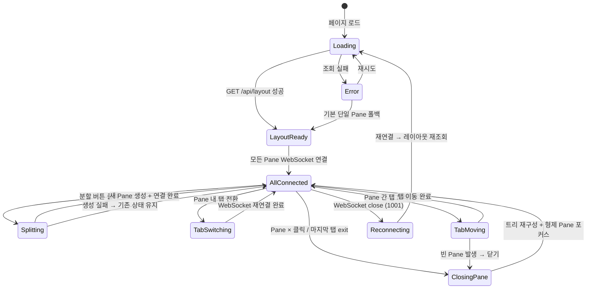

# 사용자 흐름

## 1. 페이지 로드 → 레이아웃 복원

1. 사용자가 `localhost:{port}`에 접속
2. 페이지 렌더링 (단일 Pane 스켈레톤 + 터미널 배경)
3. `GET /api/layout` → 레이아웃 트리 조회
4. 레이아웃이 없으면 → 기본 단일 Pane 생성 (Phase 3 초기 상태와 동일)
5. 트리 구조에 따라 `Group`/`Panel`/`Separator` 렌더링
6. 각 Pane이 자신의 활성 탭 세션에 WebSocket 연결 (병렬)
7. 각 Pane의 tmux attach → redraw → 터미널 렌더링
8. `focusedPaneId`에 해당하는 Pane에 포커스 설정

**체감 속도 목표**: 페이지 로드 ~ 모든 Pane 터미널 프롬프트까지 1000ms 이내
**최적화**: 각 Pane의 WebSocket 연결을 병렬로 수행 (순차 아님)

## 2. Pane 분할

```
분할 버튼 (┃ 또는 ━) 클릭
→ 버튼 disabled (로딩 피드백)
→ GET /api/layout/cwd?session={현재 활성 세션} → CWD 조회
→ POST /api/layout/pane { cwd } → 서버: tmux 세션 생성 + Pane/탭 정보 반환
→ 클라이언트: 트리에 새 split 노드 삽입 (기존 Pane + 새 Pane)
→ PUT /api/layout → 전체 트리 저장
→ UI: Separator 출현 + 새 Pane 0→50% 확장 (200ms ease-out)
→ 새 Pane의 xterm.js 생성 + WebSocket 연결
→ 새 Pane에 포커스 이동
→ 분할 버튼 재활성화
```

### Optimistic UI

- 트리 구조 변경은 서버 응답 후 적용 (tmux 세션 생성이 필요하므로 optimistic 불가)
- 대신 분할 버튼 로딩 피드백으로 즉각 반응감 제공
- CWD 조회와 Pane 생성을 직렬 호출하되, CWD 실패 시 홈 디렉토리 폴백

### 실패 시

- CWD 조회 실패 → 홈 디렉토리로 폴백 (분할은 진행)
- Pane 생성 실패 → 버튼 재활성화 + toast "분할할 수 없습니다"
- 트리 저장 실패 → 로컬 트리는 유지, 백그라운드 재시도

## 3. Pane 내 탭 전환

```
Pane A의 비활성 탭 클릭
→ Pane A의 탭 바: 클릭한 탭을 즉시 활성 표시 (optimistic)
→ Pane A의 현재 WebSocket 닫기 (detach)
→ Pane A의 xterm.js reset()
→ 새 세션 ID로 WebSocket 연결 (/api/terminal?session={id})
→ tmux attach → redraw → 화면 복원
→ PUT /api/layout (activeTabId 갱신, 디바운스)
```

- 다른 Pane(B, C)에 전혀 영향 없음
- 빠른 연속 전환: 진행 중인 WebSocket을 abort → 최신 전환만 처리

### 롤백

- WebSocket 연결 실패 → 이전 활성 탭으로 복귀 + 에러 표시
- tmux 세션 사라짐 → 해당 탭 제거 + 인접 탭 전환 (또는 Pane 닫기)

## 4. Pane 닫기

```
Pane B의 × 버튼 클릭
→ DELETE /api/layout/pane/{paneId} → 서버: 모든 tmux 세션 kill
→ Pane B의 xterm.js dispose() + WebSocket close
→ 트리 재구성: Pane B 제거, 형제 Pane이 전체 영역 차지
→ UI: Pane B 축소 → 소멸 (150ms), 형제 Pane 확장
→ Pane B가 포커스였으면 → 형제 Pane에 포커스 이동
→ PUT /api/layout → 트리 저장
→ Pane 수가 2→1이 되면 남은 Pane의 닫기 버튼 숨김
```

### 실패 시

- 세션 kill 실패 → toast 에러, Pane은 유지
- 트리 저장 실패 → 로컬 트리는 갱신 완료, 백그라운드 재시도

## 5. Pane 내 exit

```
Pane B의 활성 탭에서 exit 입력
→ tmux 세션 종료 → WebSocket close code 1000
→ Pane B에서 해당 탭 제거
→ Pane B에 다른 탭이 있으면 → 인접 탭으로 전환
→ Pane B의 탭이 비면:
  → Pane이 1개뿐: 새 탭 자동 생성 (Phase 3 동작)
  → 복수 Pane: Pane B 닫기 (4번 흐름과 동일)
→ PUT /api/layout
```

## 6. Pane 간 탭 이동

```
Pane A의 Tab A2를 드래그 시작
→ Tab A2: opacity: 0.3 (자리 표시)
→ 커서에 반투명 고스트 표시
→ Pane B의 탭 바 위로 진입
→ Pane B 탭 바 하이라이트 + 삽입 위치 인디케이터
→ 드롭
→ UI: Tab A2가 Pane A에서 제거, Pane B에 추가 (optimistic)
→ PUT /api/layout (Tab A2의 소속 Pane 변경)
→ Pane B가 Tab A2의 세션에 WebSocket 연결
→ Pane A의 탭이 비면:
  → 단일 Pane: 새 탭 자동 생성
  → 복수 Pane: Pane A 닫기 → 분할 버튼 재활성화 (자연스러운 순환)
```

### Optimistic UI

- 탭 이동은 즉시 UI에 반영 (tmux 세션은 유지되므로 롤백 위험 낮음)
- PUT 실패 시 → 탭을 원래 Pane으로 복귀

### 같은 Pane 내 드래그

- Phase 3 탭 순서 변경 동작 그대로 (인디케이터 → 드롭 → 순서 변경)

## 7. Pane 리사이즈

```
Separator 드래그 시작
→ 드래그 중: Panel 비율 실시간 변경
→ 각 Pane의 onResize 콜백 → requestAnimationFrame 스로틀로 xterm.js fit()
→ fit() → tmux resize-window (서버 WebSocket 경유)
→ 드래그 종료
→ PUT /api/layout (새 비율 저장, 디바운스 300ms)
```

- 최소 크기(200×120px) 이하로 축소 불가 (`minSize` prop이 자동 방지)

## 8. 새로고침 / 서버 재시작

### 새로고침

```
F5/Cmd+R
→ 모든 WebSocket 끊김 (서버: detaching=true)
→ 페이지 리로드
→ GET /api/layout → 전체 트리 복원
→ 각 Pane이 활성 탭 세션에 WebSocket 재연결 (병렬)
→ tmux redraw → 화면 복원
→ focusedPaneId 복원
```

### 서버 재시작

```
서버 종료 → 모든 WebSocket close (1001)
→ 각 Pane: reconnecting 상태
→ 서버 재시작 → layout.json + tmux 정합성 체크
→ 클라이언트 재연결 → GET /api/layout → 트리 복원
→ 각 Pane WebSocket 연결 → 화면 복원
```

## 9. 상태 전이



## 10. 엣지 케이스

### 분할 직후 즉시 닫기

- 분할 완료 전에 Pane 닫기 클릭 → 분할 완료까지 닫기 버튼 비활성화
- 분할 완료 후 바로 닫기 가능

### 탭 이동으로 3→2 Pane → 즉시 분할

- Pane 3개 상태에서 탭 이동 → 빈 Pane 닫기 → 2개가 됨 → 분할 버튼 즉시 재활성화
- 사용자 체감: "탭을 옮기면 자리가 비워지고, 다시 분할할 수 있다"

### 모든 Pane에서 동시에 exit

- 3개 Pane 모두 마지막 탭에서 exit → 각각 순차 처리
- 마지막으로 남는 1개 Pane에서 새 탭 자동 생성

### 브라우저 극단적 리사이즈

- 브라우저를 매우 좁게 줄임 → `minSize={200}` / `minSize={120}`이 하한 보장
- 3개 Pane이 모두 최소 크기 이하로 내려갈 수 없음 → 라이브러리가 자동 처리

### 서버 재시작 중 분할 시도

- reconnecting 상태에서 분할 버튼 클릭 → API 실패 → 에러 표시
- 재연결 완료 후 분할 가능
