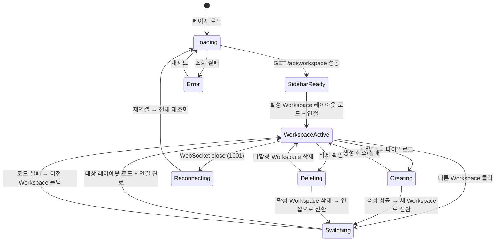

# 사용자 흐름

## 1. 페이지 로드 → Workspace 복원

1. 사용자가 `localhost:{port}`에 접속
2. 페이지 렌더링 (사이드바 스켈레톤 + 메인 영역 빈 배경)
3. `GET /api/workspace` → Workspace 목록 + 활성 ID + 사이드바 상태 조회
4. Workspace 목록이 비면 → 기본 Workspace 자동 생성 (홈 디렉토리)
5. 사이드바 렌더링 (접기/펼치기 상태 + 너비 복원)
6. 활성 Workspace의 레이아웃 로드 (`GET /api/layout?workspace={id}`)
7. Pane 트리 렌더링 → 각 Pane의 xterm.js 생성 + WebSocket 연결 (병렬)
8. 모든 WebSocket 연결 완료 후 포커스 Pane에 `focus()`

**체감 속도 목표**: 페이지 로드 ~ 터미널 프롬프트까지 1000ms 이내
**최적화**: Workspace 목록 조회와 레이아웃 조회를 직렬 호출하되, WebSocket 연결은 병렬

## 2. Workspace 생성

```
사이드바 + 버튼 클릭
→ 생성 다이얼로그 표시
→ 사용자가 디렉토리 경로 입력
→ 입력 중 디바운스 300ms → GET /api/workspace/validate
→ 유효: 이름 미리 표시 + 추가 버튼 활성화
→ 미유효: 에러 메시지 표시 + 추가 버튼 비활성화
→ 추가 클릭
→ 추가 버튼 disabled + 스피너
→ POST /api/workspace { directory }
→ 서버: 디렉토리 검증 + tmux 세션 생성 + Workspace 생성
→ 성공:
  → 다이얼로그 닫기
  → 사이드바에 새 Workspace 추가
  → Workspace 전환 흐름 시작 (3번)
```

### 실패 시

- 디렉토리 미존재 / 중복: 다이얼로그 유지 + 에러 메시지 갱신
- 서버 에러: toast "Workspace를 생성할 수 없습니다" + 다이얼로그 유지
- 추가 버튼 재활성화

## 3. Workspace 전환

```
사이드바에서 비활성 Workspace 클릭
→ 사이드바: 클릭한 Workspace를 즉시 활성 표시 (optimistic)
→ 현재 레이아웃 저장: PUT /api/layout?workspace={currentId} (fire-and-forget)
→ 현재 Workspace의 모든 xterm.js dispose() + WebSocket close (detach)
→ 메인 영역: 현재 터미널 fade out (100ms) → 로딩 인디케이터
→ GET /api/layout?workspace={targetId} → 대상 레이아웃 로드
→ Pane 트리 렌더링 → 각 Pane의 xterm.js 생성
→ 각 Pane의 활성 탭 세션에 WebSocket 연결 (병렬)
→ 모든 WebSocket 연결 완료 → 포커스 Pane에 focus()
→ 로딩 인디케이터 fade out → 터미널 fade in
→ PATCH /api/workspace/active (디바운스 300ms)
```

### Optimistic UI

- 사이드바 활성 표시는 즉시 (서버 응답 전)
- 레이아웃 저장(fire-and-forget)은 전환 속도에 영향 없음

### 롤백

- 대상 레이아웃 로드 실패 → 이전 Workspace로 복귀 + toast "전환할 수 없습니다"
- 이전 Workspace의 레이아웃은 메모리에 캐시되어 있으므로 즉시 복원
- WebSocket 일부 연결 실패 → 해당 Pane만 reconnecting 상태, 나머지 정상

## 4. Workspace 삭제

```
Workspace 항목 우클릭 → 컨텍스트 메뉴 → "삭제"
→ 확인 다이얼로그: "Workspace '{name}'을 닫으시겠습니까?"
→ 사용자 확인 클릭
→ 해당 항목 opacity 감소 (삭제 중 피드백)
→ 활성 Workspace인 경우:
  → 인접 Workspace로 먼저 전환 (3번 흐름)
→ DELETE /api/workspace/{id}
→ 서버: 모든 tmux 세션 kill + 데이터 삭제
→ 사이드바에서 해당 항목 제거 (fade out 150ms)
→ 마지막 Workspace였으면:
  → POST /api/workspace (홈 디렉토리로 기본 Workspace 생성)
  → 새 Workspace로 전환
```

### 실패 시

- DELETE 실패 → opacity 복원 + toast "삭제할 수 없습니다"
- 기존 상태 유지 (세션도 살아있음)

## 5. Workspace 이름 변경

```
Workspace 항목 더블클릭 (또는 컨텍스트 메뉴 → "이름 변경")
→ 인라인 input 표시 (기존 이름 선택 상태)
→ 사용자 입력
→ Enter 또는 blur
→ UI: 즉시 새 이름 반영 (optimistic)
→ PATCH /api/workspace/{id} { name }
→ Escape: 편집 취소, 이전 이름 복원
→ 빈 이름: 디렉토리명으로 자동 복원
```

### 실패 시

- PATCH 실패 → 이전 이름으로 롤백

## 6. 사이드바 접기/펼치기

```
접기 토글 클릭 (◀)
→ 사이드바: 200ms ease로 너비 0px 축소 (완전 숨김)
→ 메인 영역: 전체 너비로 확장
→ 모든 Pane의 xterm.js fit() (스로틀)
→ 펼치기 버튼 표시 (메인 영역 좌측 상단, hover 시)
→ PATCH /api/workspace/active { sidebarCollapsed: true } (디바운스)

펼치기 버튼 클릭 (▶)
→ 사이드바: 200ms ease로 저장된 너비로 확장
→ 메인 영역: 사이드바 너비만큼 축소
→ 모든 Pane의 xterm.js fit()
→ PATCH /api/workspace/active { sidebarCollapsed: false }
```

## 7. 사이드바 리사이즈

```
리사이즈 핸들 드래그 시작
→ 드래그 중: 사이드바 너비 실시간 변경
→ 메인 영역의 모든 Pane xterm.js fit() (requestAnimationFrame 스로틀)
→ 드래그 종료
→ PATCH /api/workspace/active { sidebarWidth } (디바운스 300ms)
```

- 최소 160px, 최대 320px 클램핑

## 8. 새로고침 / 서버 재시작

### 새로고침

```
F5/Cmd+R
→ 모든 WebSocket 끊김 (서버: detaching=true)
→ 페이지 리로드
→ GET /api/workspace → Workspace 목록 + 사이드바 상태 복원
→ 활성 Workspace의 레이아웃 로드 → Pane 트리 복원
→ 각 Pane WebSocket 재연결 (병렬)
→ 포커스 Pane 복원 + focus()
```

### 서버 재시작

```
서버 종료 → 모든 WebSocket close (1001)
→ 각 Pane: reconnecting 상태
→ 서버 재시작 → workspaces.json + 각 layout.json + tmux 크로스 체크
→ 클라이언트 재연결 → 전체 복원
```

## 9. 상태 전이



## 10. 엣지 케이스

### 빠른 연속 Workspace 전환

- Workspace A → B → C를 빠르게 클릭
- 이전 전환의 레이아웃 로드 / WebSocket 연결이 완료되기 전에 새 전환 시작
- 처리: 진행 중인 로드/연결을 abort → 최신 전환만 처리

### 전환 중 삭제

- Workspace B로 전환 중에 B를 삭제
- 처리: 전환 abort + B 삭제 → 인접 Workspace로 전환

### 생성 다이얼로그 열린 상태에서 다른 Workspace 클릭

- 다이얼로그 유지 + Workspace 전환은 정상 진행
- 생성 완료 시 전환된 Workspace가 아닌 새 Workspace로 추가 전환

### 모든 Workspace에서 동시에 exit

- 여러 Workspace에서 실행 중인 프로세스가 동시에 종료
- 각 Workspace 독립 처리 — 활성 Workspace에서만 탭 제거/Pane 닫기 동작
- 비활성 Workspace는 다음 전환 시 정합성 체크에서 정리

### 디렉토리가 삭제된 Workspace

- Workspace의 프로젝트 디렉토리가 외부에서 삭제됨
- 전환 시 터미널은 정상 동작 (tmux 세션의 CWD만 영향)
- 새 탭 생성 시 CWD 폴백 (홈 디렉토리)
