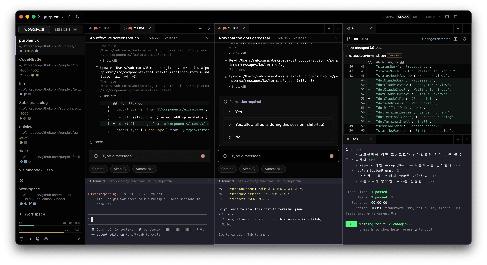
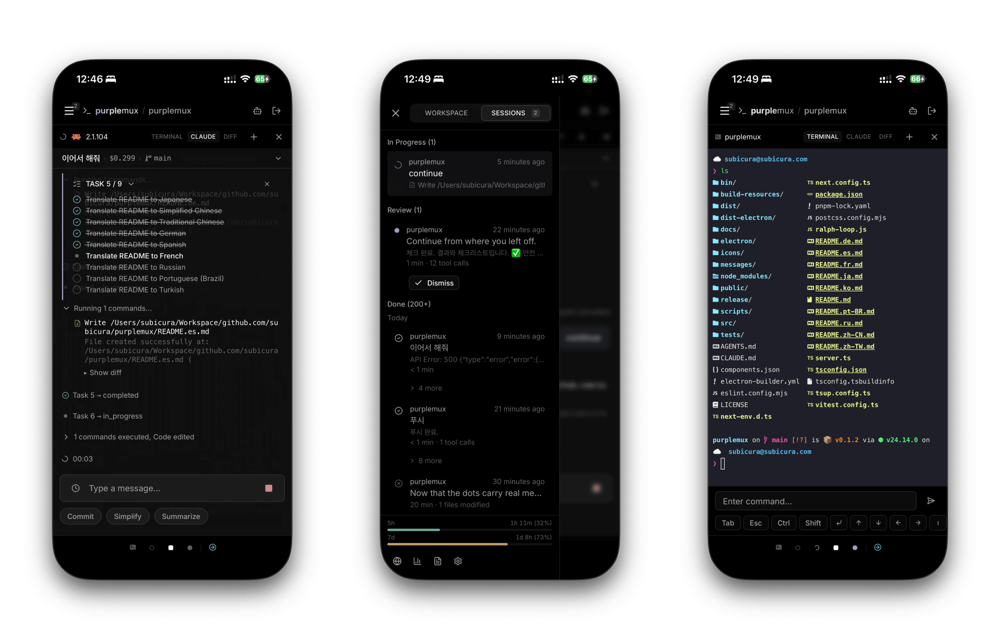

# codexmux

Codex 작업을 tmux 기반 웹 세션으로 관리하는 self-hosted session manager입니다.

한 화면에서 여러 Codex 세션을 확인하고, 모바일에서도 같은 작업 공간에 다시 접속할 수 있습니다.

**문서 언어: 한국어**





## 현재 저장소

- Repository: <https://github.com/HardcoreMonk/codexmux>
- Upstream reference: <https://github.com/subicura/purplemux>
- Runtime: Next.js Pages Router + custom Node server + tmux
- Package manager: pnpm
- Target: Codex-focused web session manager

## 빠른 시작

npm 배포본을 사용할 때:

```bash
npx codexmux
```

브라우저에서 접속합니다.

```text
http://localhost:8022
```

> Node.js 20 이상과 tmux가 필요합니다. macOS와 Linux를 지원하며 Windows는 지원하지 않습니다.

## 서버 실행 옵션

기본 포트는 `8022`입니다.

```bash
codexmux
```

포트와 접속 허용 범위를 고정하려면 `PORT`와 `HOST`를 지정합니다.

```bash
HOST=localhost,tailscale PORT=8122 codexmux
```

`HOST`는 콤마로 여러 값을 받을 수 있습니다.

| 값 | 의미 |
|---|---|
| `localhost` | 로컬 접속만 허용 |
| `tailscale` | Tailscale 대역만 허용 |
| `lan` | 사설 LAN 대역 허용 |
| `all` | 모든 네트워크 허용 |
| CIDR | 예: `192.168.0.0/16`, `100.64.0.0/10` |

자주 쓰는 실행값은 `~/.zshrc`에 함수로 고정할 수 있습니다.

```zsh
codexmux() {
  HOST=localhost,tailscale PORT=8122 command codexmux "$@"
}
```

소스 체크아웃 상태에서 `codexmux`가 `../dist/server.js`를 찾지 못하면 아직 배포용 빌드가 없는 상태입니다. 개발 중에는 아래 명령을 사용합니다.

```bash
corepack pnpm dev
```

## 소스에서 실행

```bash
git clone https://github.com/HardcoreMonk/codexmux.git
cd codexmux
corepack enable
corepack pnpm install
corepack pnpm dev
```

프로덕션 모드 확인:

```bash
corepack pnpm build
corepack pnpm start
```

## 주요 기능

- tmux 기반 영속 세션: 브라우저를 닫아도 터미널과 Codex 작업 상태 유지
- 멀티 워크스페이스: 패널 분할, 탭, 작업 디렉터리, 사이드바 상태 저장
- Codex 상태 감지: 작업중, 입력 대기, 리뷰 대기, 세션 resume 상태 표시
- 라이브 타임라인: Codex JSONL을 읽어 메시지, tool call, permission prompt, reasoning summary 표시
- 모바일 UI: PWA, Web Push, 재접속, 입력 draft 보존
- Git 워크플로: status, diff, history, fetch, pull, push, 충돌/dirty 상태 전달
- 사용량 통계: token, cache read/write, 비용 추정, 프로젝트별 분석, 일별 리포트
- 빠른 프롬프트: 기본 내장 프롬프트는 `Commit`만 제공하며 사용자 프롬프트를 추가할 수 있음
- CLI bridge: `codexmux tab ...` 명령으로 workspace/tab/browser API 제어

## 공식 Remote Control과 차이

공식 Remote Control은 단일 Codex 세션 원격 제어에 가깝습니다. codexmux는 여러 세션을 동시에 운영하고, tmux로 상태를 유지하며, 모바일 알림과 재접속을 함께 쓰는 흐름에 맞춰져 있습니다.

## 모바일과 Tailscale

모바일에서 같은 세션을 쓰려면 서버를 Tailscale 대역에서 접근 가능하게 실행합니다.

```bash
HOST=localhost,tailscale PORT=8122 codexmux
```

Tailscale 앱 설치와 로그인 후 HTTPS로 노출합니다.

```bash
tailscale serve --bg --https=443 http://localhost:8122
```

접속 주소는 Tailscale이 제공하는 MagicDNS 주소입니다.

```text
https://<machine>.<tailnet>.ts.net
```

해제:

```bash
tailscale serve off --https=443
```

기본 포트 `8022`로 실행 중이면 마지막 인자만 바꿉니다.

```bash
tailscale serve --bg --https=443 http://localhost:8022
```

## 보안

최초 접속 시 비밀번호를 설정합니다. 비밀번호는 평문이 아니라 scrypt 해시로 `~/.codexmux/config.json`에 저장됩니다.

비밀번호만 초기화하려면 `config.json`에서 아래 필드만 제거한 뒤 서버를 다시 시작합니다.

```json
{
  "authPassword": "...",
  "authSecret": "..."
}
```

`config.json` 전체를 삭제하면 비밀번호뿐 아니라 locale, theme, network, Codex option 같은 앱 설정도 함께 초기화됩니다.

외부에서 접속할 때는 HTTPS를 사용하세요.

- Tailscale Serve: WireGuard 터널과 자동 HTTPS 인증서 사용
- Nginx/Caddy: WebSocket 업그레이드 헤더 전달 필요

## 데이터 디렉터리

codexmux 상태는 `~/.codexmux/`에 저장됩니다. Codex CLI 원본 세션은 `~/.codex/sessions/` 아래 JSONL을 읽기 전용으로 참조합니다.

| 경로 | 내용 |
|---|---|
| `config.json` | 인증 해시, session secret, locale/theme/network/Codex 설정 |
| `workspaces.json` | workspace 목록, active workspace, sidebar 상태 |
| `workspaces/{wsId}/layout.json` | pane/tab tree와 tab metadata |
| `quick-prompts.json` | 사용자 quick prompt와 내장 prompt 표시 상태 |
| `keybindings.json` | 단축키 override |
| `vapid-keys.json` | Web Push VAPID key |
| `push-subscriptions.json` | Web Push 구독 정보 |
| `cli-token` | CLI와 hook bridge의 `x-cmux-token` |
| `port` | 현재 실행 중인 server port |
| `stats/` | Codex usage cache와 daily report |
| `logs/` | 서버 로그 |
| `uploads/` | 임시 첨부 파일 |

자세한 삭제 기준은 [docs/DATA-DIR.md](docs/DATA-DIR.md)를 참고하세요.

## 개발 명령

```bash
corepack pnpm dev
corepack pnpm build
corepack pnpm start
corepack pnpm lint
corepack pnpm tsc --noEmit
corepack pnpm test
corepack pnpm build:landing
```

로그 레벨:

```bash
LOG_LEVEL=debug corepack pnpm dev
LOG_LEVELS=status=debug,tmux=trace corepack pnpm dev
```

## CLI

서버가 실행되면 `~/.codexmux/port`와 `~/.codexmux/cli-token`이 생성됩니다. CLI는 이 값을 자동으로 읽습니다.

```bash
codexmux workspaces
codexmux tab list -w <workspace-id>
codexmux tab create -w <workspace-id> -t codex -n "new task"
codexmux tab send -w <workspace-id> <tab-id> "요청 내용"
codexmux tab status -w <workspace-id> <tab-id>
codexmux tab result -w <workspace-id> <tab-id>
```

외부 스크립트에서 직접 지정할 수도 있습니다.

```bash
CMUX_PORT=8122 CMUX_TOKEN=<token> codexmux workspaces
```

## 아키텍처

```text
Browser / PWA
  | HTTP + WebSocket
  v
custom Node server
  | Next.js Pages Router
  | /api/terminal, /api/timeline, /api/status, /api/sync
  v
tmux -L codexmux
  | session: pt-{workspaceId}-{paneId}-{tabId}
  v
shell / codex

Codex JSONL
  ~/.codex/sessions/YYYY/MM/DD/*.jsonl
  -> timeline, status, stats
```

- 터미널 I/O는 xterm.js, WebSocket, node-pty, tmux로 연결됩니다.
- 상태 감지는 tmux pane PID 아래 Codex process와 Codex JSONL 변경을 함께 봅니다.
- 서버와 Next.js API route의 공유 상태는 `globalThis` singleton으로 유지합니다.
- 전용 tmux socket인 `codexmux`를 사용하므로 사용자의 기존 tmux 세션과 분리됩니다.

관련 문서:

| 문서 | 내용 |
|---|---|
| [docs/STATUS.md](docs/STATUS.md) | Codex 작업 상태 감지와 status flow |
| [docs/TMUX.md](docs/TMUX.md) | tmux, terminal WebSocket, session 관리 |
| [docs/DATA-DIR.md](docs/DATA-DIR.md) | `~/.codexmux/` 구조와 삭제 기준 |
| [docs/STYLE.md](docs/STYLE.md) | theme와 color 사용 규칙 |

## 라이선스

[MIT](LICENSE)
